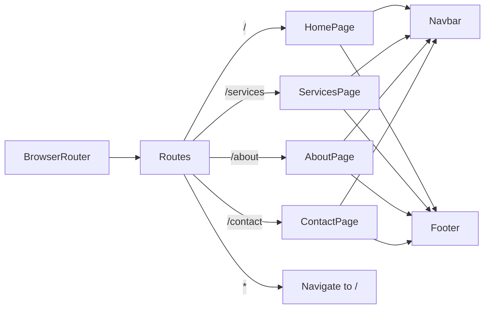

# Design Document — Ictware Site Revamp

## Overview

This document describes the technical architecture for rebuilding the Ictware web presence into a clean 4-page React application. The existing codebase is a React 19 + Vite + Tailwind 3 project with Framer Motion already installed, currently serving a "Digital Bridges Summit" event page. The revamp replaces all existing page components and routing with a new Ictware brand architecture while preserving the build toolchain and dependency baseline.

**Tech stack (unchanged):**
- React 19 + Vite 8
- Tailwind CSS 3.4
- Framer Motion 12
- React Router DOM 7
- No new runtime dependencies required

**Core design goals:**
1. A shared design system (color tokens, typography, Button, ScrollReveal) consumed by all pages
2. Four top-level pages: Home (`/`), Services (`/services`), About (`/about`), Contact (`/contact`)
3. Persistent Navbar and Footer on every page
4. Accessible, semantically correct HTML throughout
5. Reduced-motion support at every animation boundary

---

## Architecture

The application follows a page-composition architecture: pages assemble section-level components, which consume shared primitives (Button, ScrollReveal) from the design system.

```
src/
├── index.css                   ← Google Fonts import, Tailwind base layers, body defaults
├── App.jsx                     ← BrowserRouter + Routes (4 routes + catch-all redirect)
├── components/
│   ├── ui/
│   │   ├── Button.jsx          ← Ghost/filled button primitive
│   │   └── ScrollReveal.jsx    ← Framer Motion scroll-triggered wrapper
│   ├── Navbar.jsx              ← Shared top nav (replaces existing)
│   ├── Footer.jsx              ← Shared footer (replaces existing)
│   ├── home/
│   │   ├── HeroSection.jsx
│   │   ├── TrustBar.jsx
│   │   ├── BrandStrip.jsx
│   │   ├── ServicesGrid.jsx    ← Six ServiceCard instances
│   │   ├── HowWeWork.jsx
│   │   ├── Testimonials.jsx    ← TestimonialRotator
│   │   └── CtaBanner.jsx
│   ├── services/
│   │   ├── ServiceSection.jsx  ← Reused for each of the six categories
│   │   └── IndividualsVsBusinesses.jsx
│   ├── about/
│   │   └── (inline sections in AboutPage)
│   └── contact/
│       ├── ContactForm.jsx
│       └── ContactInfo.jsx
└── pages/
    ├── HomePage.jsx
    ├── ServicesPage.jsx
    ├── AboutPage.jsx
    └── ContactPage.jsx
```

### Routing

`App.jsx` uses `<BrowserRouter>` → `<Routes>` with four `<Route>` entries plus a catch-all `<Route path="*">` that renders `<Navigate to="/" replace />`.



### Design System Layer

Tailwind config is extended (not replaced) with new color tokens and font families. All existing tokens (`primary`, `teal`, `gold`, `secondary`, `neutral`, `fontFamily.display`, `fontFamily.body`) are preserved. The new tokens are additive.

---

## Components and Interfaces

### Button (`src/components/ui/Button.jsx`)

```
Props:
  variant?:    "ghost" | "filled"   default: "ghost"
  className?:  string
  onClick?:    () => void
  href?:       string               — renders <a> instead of <button>
  type?:       "button"|"submit"|"reset"  — only used when href is absent
  children:    ReactNode
```

The left-to-right fill hover animation is implemented with a CSS pseudo-element approach: a `::before` pseudo-element positioned absolutely, scaled from `scaleX(0)` to `scaleX(1)` with `transform-origin: left`, over 250ms `ease`. Text color transition is synchronised via Tailwind `transition-colors`. Both transitions are wrapped in a `@media (prefers-reduced-motion: reduce)` block that sets `transition: none`.

For invalid `variant` values, a runtime fallback: `const resolvedVariant = variant === "filled" ? "filled" : "ghost"`.

### ScrollReveal (`src/components/ui/ScrollReveal.jsx`)

```
Props:
  children:    ReactNode
  stagger?:    boolean   default: false — enables staggerChildren on a wrapper motion.div
  delay?:      number    default: 0     — base delay offset in seconds
```

Implementation uses Framer Motion `useInView` hook with `{ once: true, margin: "-50px" }` to fire once and only once per mount. The `prefers-reduced-motion` media query is read via `window.matchMedia("(prefers-reduced-motion: reduce)")` (or Framer Motion's `useReducedMotion` hook) and, when active, all children render at `opacity: 1, y: 0` without transition.

```
variants:
  hidden: { opacity: 0, y: 20 }
  visible: { opacity: 1, y: 0, transition: { duration: 0.5, ease: "easeOut" } }

stagger container variants:
  hidden: {}
  visible: { transition: { staggerChildren: 0.1 } }
```

When `children` is falsy/empty, the component returns `null`.

### Navbar (`src/components/Navbar.jsx`)

Replaces the existing component. Key behaviours:

- Logo: `src/assets/ICT-WEARE--V2-TRT-b.png` with error fallback to text
- Scroll listener (`window.scrollY > 10`) → toggles `bg-navy-950 shadow-md`
- Desktop links (≥768px): Home / Services / About / Contact + `Request a Service` Button (variant="filled") → `/contact`
- Mobile (<768px): hamburger icon replaces links; tapping opens a `<nav>` dropdown with the four links; clicking any link closes the dropdown and navigates
- Entrance animation: `motion.nav` with `initial={{ y: -80, opacity: 0 }}` → `animate={{ y: 0, opacity: 1 }}` over 500ms ease-out

### Footer (`src/components/Footer.jsx`)

Replaces the existing component. Structure:

- Col 1: Logo + mission statement + contact info (NG phone, UK phone "(coming soon)", email, hours)
- Col 2: Quick links (Home / Services / About / Contact)
- Col 3: Social icons (LinkedIn, Instagram, TikTok) opening in new tab
- Full-width bottom bar: `© 2026 Ictware. All rights reserved.`
- Background: `bg-navy-950`, text: `text-bone-50`

### ServiceCard

```
Props:
  title:       string
  icon?:       ReactNode
  slug:        string    — used to build href="/services#{slug}"
```

Renders as a clickable card that navigates to `/services#${slug}`.

### TestimonialRotator (`src/components/home/Testimonials.jsx`)

Internal state: `activeIndex` (integer). Auto-advance uses `setInterval` with a configurable `interval` prop (default 6000ms). `useEffect` clears and restarts the interval whenever `activeIndex` changes from manual interaction.

The `prefers-reduced-motion` check disables `AnimatePresence`/`motion` transitions; instead, the active testimonial is swapped with no transition (`transition={{ duration: 0 }}`).

### ContactForm (`src/components/contact/ContactForm.jsx`)

State machine: `idle` → `validating` → `submitting` → `success` / `error`.

Validation is pure: `validateForm(fields): ValidationErrors` where `ValidationErrors` is a `Record<fieldName, string | undefined>`. A form is valid when `Object.keys(validateForm(fields)).length === 0`.

The `inquiryType` query parameter is read with React Router's `useSearchParams` hook. Pre-fill logic: `if (param === "individual") setInquiryType("Individual"); else if (param === "business") setInquiryType("Business"); else /* do nothing */`. Note: the requirements specify the query parameter values as `individual`/`business` (lowercase from CTA links) but the form radio values use title-case "Individual"/"Business" — the validation in req 18.2 specifies exact match. The CTA in req 14.3–14.4 sets the param to lowercase. The ContactForm pre-fill check (req 18.2) accepts "Individual" or "Business" (title case). Resolution: the form pre-fill should also accept lowercase by normalising to title case on read, but only for the two valid values.

---

## Data Models

### Testimonial

```typescript
interface Testimonial {
  id:           string;        // unique identifier
  quote:        string;        // 10–300 characters
  role:         string;        // 1–60 characters  
  organisation: string;        // 1–60 characters
}
```

### ServiceCategory

```typescript
interface ServiceCategory {
  id:     string;                // slug: "it-support" | "networking" | "cctv" | "procurement" | "retail-inventory" | "custom-software"
  title:  string;
  icon:   ReactNode;
  blurb:  string;               // 2–3 line description
  items:  string[];             // ≥ 3 bullet inclusions
}
```

### ContactFormFields

```typescript
interface ContactFormFields {
  name:            string;   // max 100 chars, required
  email:           string;   // max 254 chars, required, valid email format
  phone:           string;   // max 20 chars, optional
  inquiryType:     "Individual" | "Business" | "";  // required
  serviceCategory: string;   // one of six slugs, required
  message:         string;   // max 1000 chars, required
}

type ValidationErrors = Partial<Record<keyof ContactFormFields, string>>;
```

### Color Tokens (Tailwind extension)

```
navy-950:  #0B1220
navy-800:  #16233D
amber-500: #D4A24C
bone-50:   #F7F3EC
slate-400: #8B93A7
```

### Font Families (Tailwind extension)

```
heading: ['Fraunces', 'serif']
body:    ['Inter', 'sans-serif']
```

---

## Correctness Properties

*A property is a characteristic or behavior that should hold true across all valid executions of a system — essentially, a formal statement about what the system should do. Properties serve as the bridge between human-readable specifications and machine-verifiable correctness guarantees.*

**Property-based testing library:** [fast-check](https://github.com/dubzzz/fast-check) for JavaScript/TypeScript, paired with [Vitest](https://vitest.dev/) as the test runner (already compatible with the Vite build).

---

### Property 1: Button variant fallback is exhaustive

*For any* string value passed as the `variant` prop to Button, the component SHALL render ghost styles when `variant` is not exactly `"filled"`, and filled styles when `variant` is exactly `"filled"`. No variant value shall cause the component to throw or render in an undefined state.

**Validates: Requirements 3.1, 3.11**

---

### Property 2: Button renders as anchor when href is provided

*For any* combination of `href` presence/absence and `type` value, when `href` is a non-empty string the Button SHALL render an `<a>` element (never a `<button>`), and when `href` is absent the Button SHALL render a `<button>` element. Additionally, when rendered as `<a>`, the `type` attribute SHALL NOT appear on the DOM node.

**Validates: Requirements 3.8, 3.9**

---

### Property 3: TestimonialRotator index wraps correctly

*For any* testimonial array of length N (where 3 ≤ N ≤ 20) and any current index i (where 0 ≤ i < N), advancing the index SHALL yield `(i + 1) % N` — ensuring the sequence wraps from the last testimonial back to the first without skipping or going out of bounds.

**Validates: Requirements 13.1, 13.2**

---

### Property 4: ContactForm validation rejects any incomplete submission

*For any* ContactFormFields object in which one or more required fields (`name`, `email`, `inquiryType`, `serviceCategory`, `message`) are empty strings, `validateForm` SHALL return a `ValidationErrors` object containing at least one error entry for each missing required field, and the form SHALL NOT enter the submitting state.

**Validates: Requirements 18.1, 18.4**

---

### Property 5: ContactPage inquiryType pre-fill accepts only valid values

*For any* string value supplied as the `inquiryType` query parameter, the ContactForm SHALL pre-fill the `inquiryType` field if and only if the normalised value is `"individual"` or `"business"` (case-insensitive, mapped to title-case "Individual"/"Business"); any other value SHALL leave the field unselected.

**Validates: Requirements 18.2, 18.3**

---

### Property 6: All rendered images have non-missing alt attributes

*For any* page rendered in the application, every `` element in the DOM SHALL have an `alt` attribute present. Decorative images SHALL have `alt=""`. Non-decorative images SHALL have alt text between 1 and 150 characters that does not begin with "image of", "picture of", or "photo of".

**Validates: Requirements 20.2**

---

## Error Handling

### Image Load Failures

All `` elements that are content-bearing (logo, hero visual, brand logos) implement an `onError` handler that falls back to visible text. This pattern is already established in the existing Navbar and Footer components and is extended consistently across:
- Navbar logo → text fallback: "Ictware"
- Footer logo → text fallback: "Ictware"
- BrandStrip logos → brand name text per item
- Hero visual → section renders without the image, text and CTAs remain

### Route Not Found

`App.jsx` includes `<Route path="*" element={<Navigate to="/" replace />} />` as the final route. The `replace` flag prevents a back-navigation loop.

### ScrollReveal Initialisation Failure

ScrollReveal is a thin wrapper around Framer Motion. If Framer Motion fails to load (extremely unlikely in a bundled app), all section components fall back to rendering their children directly in their `visible` final state by virtue of not applying conditional opacity classes. Pages are written so that content is always visible in the DOM — animations are purely additive.

### ServiceCard Anchor Not Found

When a ServiceCard link (`/services#slug`) is clicked and the target anchor doesn't exist on the ServicesPage, the browser navigates to `/services` and scrolls to the top (native browser fallback). No JavaScript error is thrown because `<Link to="/services#slug">` is a standard navigation.

### Contact Form Submission Errors

If the form is in a network-less or demo context with no backend, the form submission handler catches any thrown errors and displays a generic error message: `"Something went wrong. Please try again or contact us directly."` The form remains editable so the user does not lose their input.

### Fallback for Invalid inquiryType Query Parameter

The `useSearchParams` read is wrapped in a normalisation function that returns `null` for any value not matching the two accepted values. The form field stays unselected and no error is surfaced to the user.

---

## Testing Strategy

### Framework and Tooling

- **Test runner:** Vitest (compatible with Vite, no additional config needed)
- **Component testing:** `@testing-library/react` + `@testing-library/user-event`
- **Property-based testing:** `fast-check` (property tests for business logic units)
- **Snapshot testing:** Vitest snapshot assertions for rendered component structures

Install commands:
```bash
npm install --save-dev vitest @testing-library/react @testing-library/user-event jsdom fast-check
```

Add to `vite.config.js`:
```js
test: {
  environment: 'jsdom',
  globals: true,
  setupFiles: ['./src/test/setup.js'],
}
```

### Unit Tests (Example-Based)

These cover specific rendering outcomes, specific interaction states, and edge cases:

- **Button:** renders ghost styles by default; renders filled styles with variant="filled"; renders `<a>` when href provided; no type attribute on anchor; cursor-pointer present; ARIA and keyboard activation
- **ScrollReveal:** renders children; returns null with no children; animates once (verify `once: true` in viewport config); reduced-motion renders at final state
- **Navbar:** logo renders; four nav links present; hamburger visible below 768px (via class assertions); scroll > 10px adds navy-950 bg; Request a Service button navigates to /contact; dropdown opens/closes; entrance animation config present
- **Footer:** mission statement text present; four quick links with correct hrefs; NG phone, UK phone "(coming soon)", email, operating hours present; LinkedIn/Instagram/TikTok links open in new tab; copyright line present; navy-950 background class present
- **TrustBar:** four stat items render with correct text; navy-800 background class; horizontal/vertical responsive classes present
- **BrandStrip:** six brand entries render; image onError handler shows brand name text
- **ServicesGrid:** six ServiceCard components render; correct slugs in hrefs
- **HowWeWork:** exactly four numbered steps with correct labels; each step has a description ≤ 20 words
- **TestimonialRotator:** active indicator has distinct class; manual dot click changes active index; interval timer restarts on manual interaction
- **CtaBanner:** headline text present; Individuals link href includes `inquiryType=individual`; Businesses link href includes `inquiryType=business`
- **ServicesPage:** six sections present with correct id attributes; page intro text; two panels in Individuals vs Businesses section; Request a Service button present
- **AboutPage:** headline present; story paragraph; four "Why choose us" points; six partner names; Get in Touch button navigates to /contact
- **ContactForm:** all six field types render with associated labels; aria-required on required fields; validation errors show on empty submit; success message on valid submit; inquiryType pre-fill from valid query param; invalid query param leaves field unselected
- **ContactPage:** page heading present; NG and UK phone numbers; email as mailto link; operating hours; response note visible

### Property-Based Tests

Each property test runs a minimum of 100 iterations via `fast-check`. Tags reference this design document.

```
// Feature: ictware-site-revamp, Property 1: Button variant fallback is exhaustive
fc.assert(fc.property(fc.string(), (variantValue) => {
  const { container } = render(<Button variant={variantValue as any}>Test</Button>);
  // must render without throwing and apply ghost or filled classes
}));
```

**Property 1 — Button variant fallback** (min 100 iterations):
- Generator: arbitrary string for `variant`
- Assert: renders without throwing; "filled" → filled class; anything else → ghost class
- Tag: `Feature: ictware-site-revamp, Property 1: Button variant fallback is exhaustive`

**Property 2 — Button element type selection** (min 100 iterations):
- Generator: `fc.option(fc.webUrl())` for href; `fc.constantFrom("button","submit","reset",undefined)` for type
- Assert: href present → renders `<a>` with no `type` attr; href absent → renders `<button>`
- Tag: `Feature: ictware-site-revamp, Property 2: Button renders as anchor when href is provided`

**Property 3 — TestimonialRotator index wraps correctly** (min 100 iterations):
- Generator: `fc.integer({min:3, max:20})` for N; `fc.integer({min:0})` for i (mod N applied inside)
- Assert: `(i + 1) % N` produces a valid index 0 ≤ result < N; index 0 when advancing from N-1
- Tag: `Feature: ictware-site-revamp, Property 3: TestimonialRotator index wraps correctly`

**Property 4 — ContactForm validation rejects incomplete submissions** (min 100 iterations):
- Generator: `fc.record` with arbitrary strings for all fields, then randomly blank out 1+ required fields
- Assert: `validateForm(fields)` returns errors for each blanked required field; submitting state not entered
- Tag: `Feature: ictware-site-revamp, Property 4: ContactForm validation rejects any incomplete submission`

**Property 5 — ContactPage inquiryType pre-fill** (min 100 iterations):
- Generator: arbitrary string for the query param value
- Assert: normalised "individual"/"business" (case-insensitive) maps to pre-filled radio; any other value leaves radio unselected
- Tag: `Feature: ictware-site-revamp, Property 5: ContactPage inquiryType pre-fill accepts only valid values`

**Property 6 — All images have alt attributes** (min 100 iterations across pages):
- Generator: render each page (HomePage, ServicesPage, AboutPage, ContactPage)
- Assert: every `img` in `document.querySelectorAll('img')` has an `alt` attribute that is not undefined
- Tag: `Feature: ictware-site-revamp, Property 6: All rendered images have non-missing alt attributes`

### Integration Tests

These verify routing and navigation behaviours that depend on React Router context:

- Navigating to `/` renders HomePage (h1 content check)
- Navigating to `/services` renders ServicesPage
- Navigating to `/about` renders AboutPage
- Navigating to `/contact` renders ContactPage
- Navigating to an unmatched path redirects to `/`
- ServiceCard click navigates to `/services#slug`
- Navbar "Request a Service" navigates to `/contact`
- CTA banner "Individuals →" navigates to `/contact?inquiryType=individual`
- CTA banner "Businesses →" navigates to `/contact?inquiryType=business`

### Accessibility Checks

- Each page contains exactly one `<h1>` (verified by `document.querySelectorAll('h1').length === 1`)
- Each page contains `<nav>`, `<main>`, `<footer>` landmarks
- All interactive elements reachable and activatable via keyboard (Tab order + Enter/Space activation)
- Focus indicator visible (CSS outline ≥ 2px — verified via computed styles or class assertion)

### Dual Testing Philosophy

Unit/property tests verify that components are **correct in isolation**. Integration tests verify that components **work together as a system**. Both layers are required for this feature:
- Property tests catch edge cases the developer didn't consider (e.g., unusual variant strings, boundary testimonial array sizes)
- Integration tests catch wiring bugs (e.g., a Button that looks correct but doesn't trigger navigation)
- Example unit tests document intended behavior and serve as living specification
